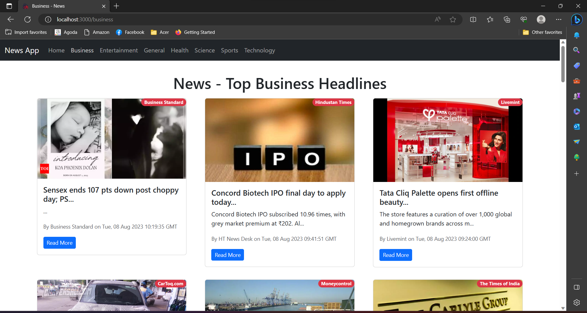
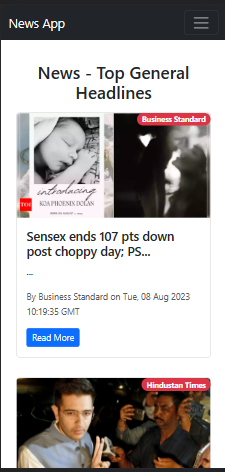
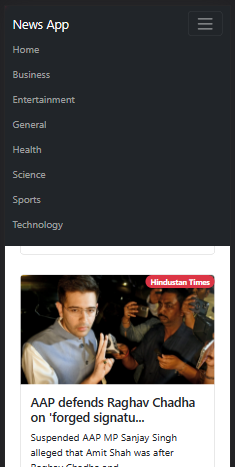

# News Application

Welcome to the News Application! This is a web application built using React and Bootstrap that allows users to browse and view news articles from various sources and categories.

## Features

- Browse news articles from different categories such as Business, Entertainment, Health, Science, Sports, Technology, and more.
- View detailed information about each news article including title, description, source, and publication date.
- Responsive design ensures a seamless user experience across different devices.

## Screenshots

#### Desktop view



#### Mobile view
#
<div align="center">
  
</div>
#
<div align="center">
  
</div>

## Installation

1. Clone the repository:

   ```bash
   git clone https://github.com/jasmeendesai/News_App.git
   ```

2. Navigate to the project directory:

   ```bash
   cd News_App
   ```

3. Install the required dependencies:

   ```bash
   npm install
   ```

4. Start the development server:

   ```bash
   npm start
   ```

5. Open your browser and go to `http://localhost:3000` to access the News Application.

## Usage

1. On the homepage, you'll see a list of top news articles from various sources.
2. Use the navigation bar to select different categories (e.g., Business, Entertainment, Health, etc.).
3. Click on a news article to view its detailed information.
4. Navigate back to the homepage or switch to a different category using the navigation bar.

## Technologies Used

- React: JavaScript library for building user interfaces.
- Bootstrap: Front-end framework for responsive and mobile-first design.
- React Router: Library for handling navigation within a React application.
- News API: External API used to fetch news articles from various sources.
